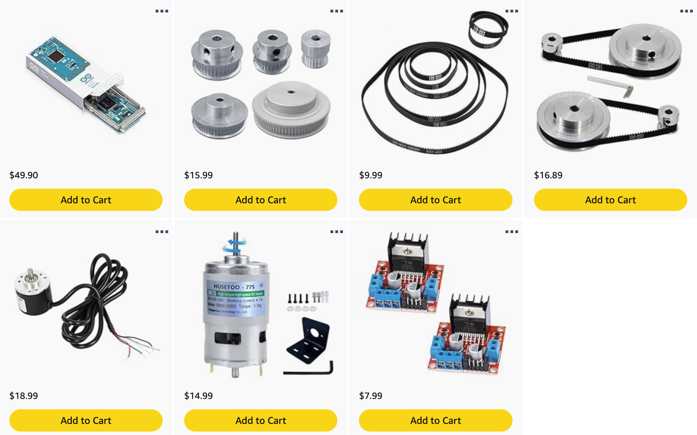

# PID Servo Motor
INSERT GIF OR VIDEO OF FINAL PROJECT

Implement position control of a brushed DC motor using PID control on physical hardware.

## Overview
* Motivation - gain experience on how to setup and tune PID control in a real project.

## Requirements
State why for each point.
* Low cost
* Low dev and build time
* Movement requirements? 
  * Only from x to y angle, doesn't need continuous rotation.
  * Typical control requirements, e.g. rise time, settling time, etc?

## Design
* General setup - vertical vs horizontal. Wanted vertical to see angle better as well as how it's affected by gravity.
* How each part was selected
  * Brushed vs brushless. Didn't want to use an existing library.
  * Encoder vs potentiometer. Need low resistance and high angle accuracy and precision. Guitar pots are low resistance, but plan on using quad encoders in future projects, so figured I might as well get the experience now.

## Parts

* [Amazon list of parts](https://www.amazon.com/hz/wishlist/ls/3C4NCHU1NNR8F?ref_=wl_share)

* Arduino
* 775 DC motor
* L289N motor driver
* Rotary quad encoder
* Belts and pulleys
* Power supply (check the max current and voltage I use)

## Schematic (how to connect everything)

## Software

## Todo
Perhaps make another shorter markdown file, which has the minimum amount of information to set up and get everything working. Don't need theory or reasons behind decisions, etc.

Just give short description of project, specs up front, parts needed, schematic, software.
